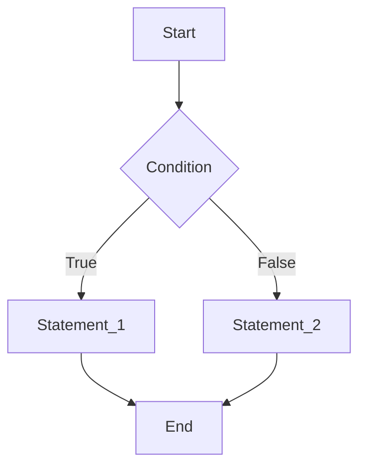
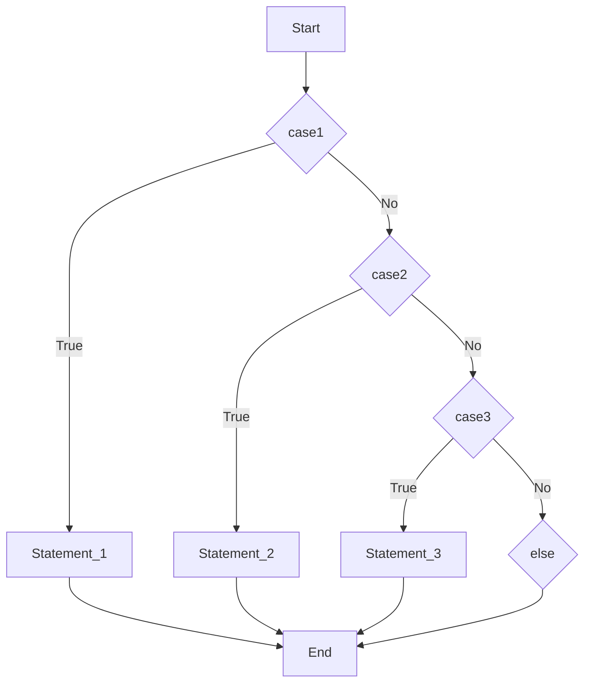
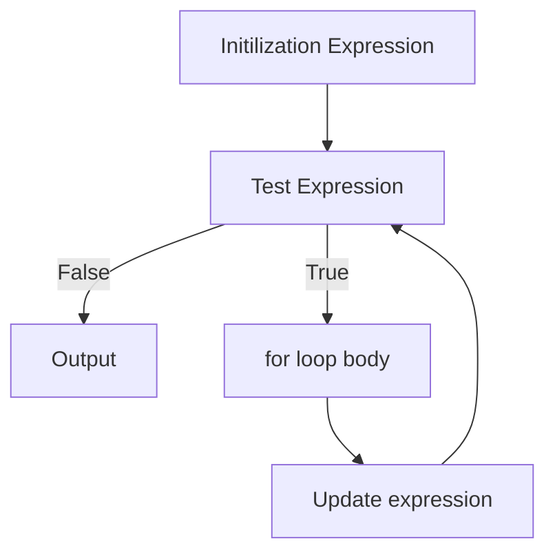
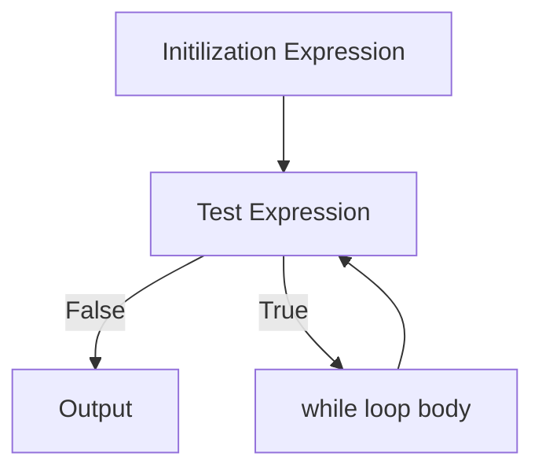

# Lecture Note

## What is C? 

`C` programming language was developmed in 1972 by **Dennis Ritchie** at bell laboratories of AT&T (American Telephon & Telegraph), located in the USA. It was initially designed form programming in UNIX operating system. Now the software tools as well as the C compiler is written in `C`. Major parts of popular operating system like Windows, UNIX, Linux is still written in `C`.

## Features of `C`

* `C` is one of the most popular languages used today.
* `C` is a robust programming with an impressive set of built-in functions and a variety of operators which you can use to write any complex program.
* `C` combines the power and capability of assembly language with the user friendly features of a high-level language.
* `C` is the most widely used older programming language. It continues to go strong while older programming languages such as `BASIC` and `COBOL` have been virtually forgotten.
* `C` is portable, which means prorammes written on a machine using `C` can be used on other machines as well wightout any modification.

| Data Type | Size in Bytes | Range | Format |
| :---------: | :-------------: | :-----: | :------: |
| signed char | 1 | (-128, 127)| `%c` |
| unsigned char | 1 | (0, 255) | `%c` |
| int | 2/4 | (-32,768, 32,767) / (-2,147,483,648, 2,147,483,647) | `%d` |
| unsigned int | 2/4 | (0, 65,535) / (0, 4,294,967,295) | `%d` |
| Float | 4 | (3.4e-38, 3.4e+38) | `%f` | 
| Double | 8 | (1.7e-308, 1.7e+308) | `%lf` |

## Operators in `C`

1. Unary operator:
   1. `++`
   2. `--`
2. Binary operator:
   1. Arithmetic operator: `+`, `-`, `*`, `/`, `%`
   2. Relational operator: `>`, `<`, `>=`, `<=`, `==`, `!=`
   3. Logical operator: `&&`(AND), `||`(OR), `!`(NOT)
   4. Assignment operator: `=`, `+=`, `-=`, `*=`, `/=`, `%=`
3. Ternary operator: 
   1. Ternary conditional operator: `?:`
    The Ternary conditaional operator's example:
    ```C
        #include <stdio.h>

        int main(void){
            int x = 5;
            (x > 10) ? 2 * x: 3 * x;
            printf("x = %d", x);
        }
    ```

## Variables in `C`

### What is variable?

Variables in `C` have the same meaning as varaibles in algebra. A variables in `C` is a storage unit, which sets a space in memory to hold a value and can take different values at different times during program execution.

## Rules to construct a valid variable name 
1. A variable name may consists of letters, digits and the underscore (`_`) characters.
2. A variable name must begin with a letter. Some system allows to starts the variable name with an underscore as the first character.
3. ANSI standard recognizes a length of 31 characters for a variable name. However, the length shold not be normally more than any combination of eight alphabets, digits, and underscores.
4. **Uppercase and lowercase are significant.** For example, `A_1 != a_1`
5. The varaible name may not be a `C` reserved word (keyword, for example, `if`, `break`, etc.)

## Control Statements

1. Dicison Making Statements
   1. `if` statement
   2. `switch` statement
2. Iterative Statements
   1. `while` statement
   2. `do - while` statement
   3. `for` statement 
3. Jump Statement
   1. `break`
   2. `continue`
   3. `goto`

### `If` Statement

```C
#include <stdio.h>

int main(void){
    if (condition){
        statements;
    }
    return 0;
}
```


Here is an example, identify the input is larger than 10 or not:

```C
#include <stdio.h>

int main(void){
    printf("Enter your number: ");
    scanf("Enter your number: %d", &n);
    if (n < 10){
        printf("Your number is less than 10\n");
    }
    else{
        printf("Your number is larger than 10\n");
    }
    return 0;
}
```

## `switch` Statement

The `switch` statement allows us to execute one code block among many alternative. You can use multiple `if`, `else`, `else if`. However, the syntax of the `switch` statement is much easier to read and write.

```C
#include <stdio.h>

int main(void){
    switch (expression){
        case constant1:
        //statements
        break;
        case constant2:
        //statements
        breaks
        // ...
    }
    return 0;
}
```
Here is the flow chart:



Here is an exmaple:

```C
// Program to create a simple calculator
#include <stdio.h>

int main(void) {
    char operator;
    double n1, n2;

    printf("Enter an operator (+, -, *, /): ");
    scanf("%c", &operator);
    printf("Enter two operands: ");
    scanf("%lf %lf",&n1, &n2);

    switch(operator)
    {
        case '+':
            printf("%.1lf + %.1lf = %.1lf",n1, n2, n1+n2);
            break;

        case '-':
            printf("%.1lf - %.1lf = %.1lf",n1, n2, n1-n2);
            break;

        case '*':
            printf("%.1lf * %.1lf = %.1lf",n1, n2, n1*n2);
            break;

        case '/':
            printf("%.1lf / %.1lf = %.1lf",n1, n2, n1/n2);
            break;

        // operator doesn't match any case constant +, -, *, /
        default:
            printf("Error! operator is not correct");
    }

    return 0;
}
```

## Loop Satements

### For loop 

The `for` loop is intuitive, we contintue the loop untail we get the stop criterion. The syntax of the `for` loop is:

```C
for (initializationStatement; textExpression; updateStatement){
    // statements inside the body of loop
}
```



Here is an exmaple:

```C
// Print all prime number less than N
#include <stdio.h>

int main(void){
    int N;
    printf("Enter the number:");
    scanf("%d", &N);
    for (int i = 1; i < N; i++){
        int flag = 0;
        for (int j = 2; j < i; j++){
            if (i % j == 0){
                flag = 1;
                break;
            }
        }  
        if (flag == 0){
            printf("Number: %d is a prime\n", i);
        }
    }
}
```
(This is a for-for-if structure)

## `while` loop

The `while` loop is very similar to the `for` loop:


```C
while (initializationStatement; textExpression; updateStatement){
    // statements inside the body of loop
}
```
The flow chart is shown below:



Here is an example:

```C
// Print numbers from 1 to 5

#include <stdio.h>
int main(void){
    int i = 1;
    while (i <= 5){
        printf("%d\n", i);
        i++;
    }
    return 0;
}
```

## Array

`C` programming language provides a data structure called the **array**, which can store a fixed-size sequential collection of elements of the same type. An **array is used to store a collection of data, but it is often more usefull to think of an array as a collection of variables of the same type.

Instead of declaring individual variables, such as `num_0`, `num_1`, `num_100`, you can declare one array variable such as `numbers` and use `numbers[0]`, `numbers[1]` and ..., to represent individual variables. A specific element in an array is accessed by an **index**.

All arrays consist of contiguous memory locations. The lowest address corresponds to the first element and the highest address to the last element.

[[Numbers[0]] [Numbers[1]] [Numbers[2]] [Numbers[...]] [Numbers[10]]]

### Declaring Arrays

To declare an array in `C`, we first specify the type of the elemetns and the number of elements required by an array as follows:

```C
type arrayName [arraySize];
```
This is called a single-dimensional array. The arraySize must be an integer constant greater than zero and type can be any valid C data type. For example, to declare a 10-element array called balance of type double, use this statement:

```C
double balance[10];
```

Here is an example:

```C
#include <stdio.h>
int main (){
    nt n[ 10 ]; /* n is an array of 10 integers */
    int i,j;
    /* initialize elements of array n to 0 */ 
    for ( i = 0; i < 10; i++){
        n[ i ] = i + 100; /* set element at location i to i + 100 */
    }

    /* output each array element's value */
    for (j = 0; j < 10; j++){
        printf("Element[%d] = %d\n", j, n[j]);
    }
    return 0;
}
```
### Two-dimensional Arrays

Similar to the above one-dimensional Array, the two-dimensional array is actually a matrix:

```C
#include <stdio.h>

int main (void){
    int n[10][4]; /* n is an array of 10 * 4 integers */
    int i, j;
    /* initialize elements of array n to 0 */ 
    for (i = 0; i < 40; i++) {
        for (int k = 0; k < 4; k++){
            n[i][k] = i + 100; /* set element at location i to i + 100 */
        }
    }
    /* output each array element's value */
    for (j = 0; j < 10; j++){
        for (int k = 0; k < 4; k++){
            printf("Element[%d][%d] = %d\n", j, k, n[j][k]);
        }
    }
    return 0;

}
```

## Pointers in `C`

Every varaible is a memory location and every momory location has its address defined which can be accessd using ampersand (`&`) operator, which denotes an address in memory.

Consider the following example, which will print the address of the variables defined:

```C
#include <stdio.h>
int main ()
{
 int var1;
 char var2[10];
 printf("Address of var1 variable: %p\n", &var1 );
 printf("Address of var2 variable: %p\n", &var2 );
 return 0;
}
```
### What is Pointers?

A pointer is a variable whose value is the address of another variable, i.e., direct address of the memory location. Like any variable or constant, you must declare a pointer before you can use it to store any variable adress. The general form of a pointer variable declaration is:

```C
type * variable_name;
```

Here, `type` is hte pointer's base type; it must be a valid `C` data type and `variable_name` is the name of the pointer variable. The asterisk * you used to declare a pointer is the same asterisk that you use for multiplication. However, in this statement the asterisk is being used to designate a variable as a pointer. Following are the valid pointer declaration:

```C
int     *ip; // pointer to an integer
double  *dp; // pointer to a double
float   *fp; // pointer to a float
char    *cp; // pointer to a character 
```

The actual data type of the value of all pointers, whether integer, gloat, character, or otherwise, is the same, a long hexadecimal number that represents a memory address. The only difference between pointers of different data types is the data type of the variable or constant that pointer points to.

### How to use Pointers?

There are few important operations, which we will do with the help of pointers very frequently:
1. we define a pointer variable
2. assign the address of a variable to a pointer 
3. access the value at the address ilable in the pointer variable

```C
#include <stdio.h>

int main (void){
    int var = 20;
    int *ip;
    ip = &var;
    printf("Address of var is: %p\n", &var);
    printf("Address stored in ip is: %p\n", ip);
    printf("value of *ip is: %d", *ip);
    return 0;
}
 ```

In the above exmaple, we can see, the process of assigning value to a variable can seperate into two steps:
1. allocate a fixed-size memory of certain data type. (`int` needs 4 bytes)
2. read value and store value into the memory `ip = &var`

### Pointer array
 
The purpose of pointer array are:
1. we can store different length of array into a two-dimension-liked array
2. sharing data

For example, for a school, it has 4 classes, different classes has different amount of students (4, 6, 3, 2). If we use a two-dimension array to store the student information, we need a 6 * 4 array which may waste some of the memory.  If we use a pointer array, this can avoid the waste of memory.

```C
#include <stdio.h>

int main(void){
    int num[4] = {4, 6, 3, 2};
    int *a[4], a_0[num[0]], a_1[num[1]], a_2[num[2]], a_3[num[3]];
    a[0] = a_0;
    a[1] = a_1;
    a[2] = a_2;
    a[3] = a_3;

    for(int i=0; i< 4; i++){
        printf("Enter class %d student's age:\n", i+1);
        for (int j=0; j<num[i]; j++){
            scanf("%d", &a[i][j]);
            printf("class %d, student No.%d 's age is: %d\n", i, j+1, (*a[i])+j);
            printf("class %d, student No.%d 's age is: %d\n", i, j+1, a[i][j]);
        }
    }
    return 0;
}
```